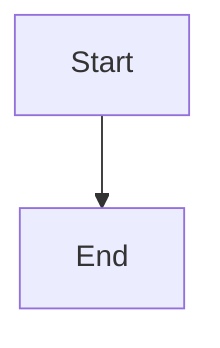

# Mermaid to Static SVG Converter

Converts dynamic Mermaid diagrams to static SVG images for better performance and accessibility.

## Prerequisites

- Python 3.7+
- Node.js 14+
- Jekyll (for local testing)

## Quick Start

```bash
bash scripts/setup.sh
```

## Manual Setup

If you can't run the setup script:

1. Install dependencies:
```bash
pip install -r requirements.txt
npm install -g @mermaid-js/mermaid-cli
```

2. On Linux, install Chrome dependencies:
```bash
sudo apt install -y libnss3 libatk1.0-0 libatk-bridge2.0-0 libcups2 libdrm2 libxkbcommon0 libxcomposite1 libxdamage1 libxfixes3 libxrandr2 libgbm1 libasound2
```

3. Generate fonts:
```bash
python3 scripts/generate_embedded_fonts.py
```

## How It Works

1. Add flag to post front matter:

```yaml
---
mermaid: true
use_static_image: true  # ← Add this line
---
```

2. Generate static images:

```bash
python3 scripts/generate_images_only.py "053.md"
```

3. Test locally:

```bash
bundle exec jekyll serve
```

## Usage

```bash
# Generate images for all posts
python3 scripts/generate_images_only.py

# Generate for specific posts
python3 scripts/generate_images_only.py "053.md"

# Force regeneration of all images
python3 scripts/generate_images_only.py --force

# Force regeneration of specific post
python3 scripts/generate_images_only.py "053.md" --force

# Verbose output
python3 scripts/generate_images_only.py --verbose
```

## Project Structure

```
gitfichas/
├── _posts/              # Markdown posts with mermaid diagrams
├── assets/img/mermaid/  # Generated static SVG files
├── scripts/             # Setup and generation scripts
└── requirements.txt     # Python dependencies
```

## Example

**Input** (`_posts/2024-01-01-example.md`):
````markdown
---
title: "My Post"
mermaid: true
use_static_image: true
---


````

**Output**: Creates `assets/img/mermaid/2024-01-01-example-0.svg`

## Maintenance

Remove all generated images:
```bash
rm -rf assets/img/mermaid/*.svg
```

Regenerate everything:
```bash
python3 scripts/generate_images_only.py --force
```

## Troubleshooting

**Browser launch fails:** Run `scripts/setup.sh` to install Chrome dependencies

**Missing fonts:** Run `python3 scripts/generate_embedded_fonts.py`

**Image not showing:** Verify `use_static_image: true` is in front matter and SVG exists in `assets/img/mermaid/`

**Debug mode:** Use `--verbose` flag for detailed output

**Sandboxed environments (Docker, CI/CD):** A `puppeteer-config.json` file is included to configure Chrome with `--no-sandbox` flag. Update the `executablePath` if your Chrome/Chromium is in a different location than `/usr/bin/chromium`.

## License

MIT License - Feel free to adapt for your own Jekyll sites!